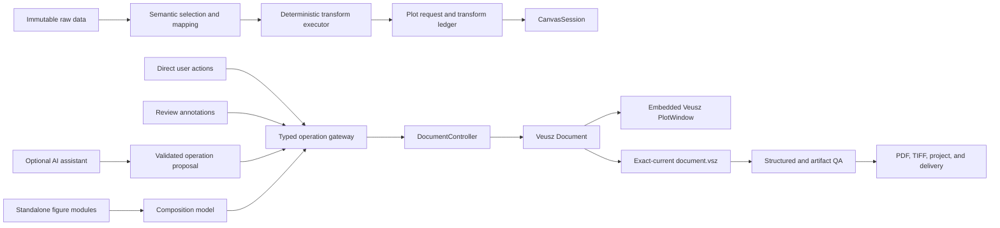

# SciPlot AI-Enhanced Canvas Development Roadmap

Status: active product roadmap, 2026-07-17. M0 and M1 complete; M2 is in
progress. Its adaptive visual foundation and bounded contextual editing kernel
are complete; review annotations and the real-session retirement gate remain.

This roadmap supersedes the former assumption that native canvas work and
multi-panel composition should remain deferred. Distribution to other users is
still future work. The active objective is to make SciPlot the best daily
research-figure environment for its owner first.

## North-star objective

Build SciPlot into a personal, daily-use, AI-enhanced scientific plotting
workbench that replaces the Veusz application frontend with a focused SciPlot
canvas while retaining Veusz as the document, rendering, and export engine.

The finished system must:

- turn raw experimental data into editable, publication-oriented figures;
- show every user or AI visual operation on a live canvas;
- support point-and-click selection, direct manipulation, review annotations,
  and native multi-panel composition without repeated verbal coordinate
  descriptions;
- let AI interpret scientific intent and propose typed operations, but never
  require AI for supported deterministic workflows;
- make accepted AI work reusable by promoting repeated decisions into rules,
  fixtures, policies, or QA;
- preserve immutable raw inputs, explicit data transformations, exact-current
  VSZ visual authority, PDF/TIFF export, QA, and delivery evidence;
- return `ready` without AI image inspection for inputs inside a validated
  deterministic envelope, and stop honestly at `needs_human_confirmation` or
  `needs_rule_repair` outside it.

The goal is not to maximize how much AI does. The goal is to reserve AI for
ambiguity and new intent while moving repeated execution into deterministic
software.

## First-principles decisions

1. **The user wants a trustworthy figure, not a renderer object tree.**
   SciPlot owns the normal product experience.
2. **Geometry is a spatial problem.**
   Selection, movement, alignment, sizing, annotation, and composition belong
   on a canvas, not in a long chat.
3. **Scientific meaning is a language problem.**
   AI is valuable for sample meaning, column roles, comparison intent, unusual
   transformations, and explaining requested changes.
4. **Execution is a software problem.**
   Parsing, transformation, rendering, QA, saving, export, and delivery must be
   deterministic and testable.
5. **There must be one visual authority.**
   The exact current `studio/document.vsz` remains authoritative after user or
   AI edits. A request/spec can regenerate a baseline, but cannot silently
   overwrite an edited VSZ.
6. **AI and humans use the same operation gateway.**
   AI must not click the Veusz GUI, patch a VSZ as arbitrary text, or inject
   unvalidated Python into the active document.
7. **AI is optional but deeply integrated.**
   Disabling the assistant must not disable supported plotting, editing, QA,
   export, or delivery.
8. **Every first-time AI success should reduce future AI dependence.**
   Repeated scientific mappings and styling decisions become shared rules and
   tests.
9. **Success claims stay separated.**
   Lifecycle success, exact-current artifact QA, provenance completeness, and
   journal-specific compliance are different fields.

## Product and renderer boundary

### Retired from the normal product frontend

- Veusz `MainWindow`;
- the full upstream object tree and property editor as the default user
  experience;
- AI automation through GUI clicks;
- the browser's export-only static image as the primary editing canvas.

### Retained as the rendering engine

- Veusz `Document`;
- Veusz `PlotWindow` for live drawing and object/data-point interaction;
- Veusz `CommandInterface` and document operations;
- Veusz undo/redo semantics where they can be safely composed;
- native VSZ saving, reopening, and exact-current export;
- an explicit Advanced Editor recovery route until SciPlot proves sufficient
  over real daily work.

Retiring the Veusz frontend does not mean deleting or forking the upstream
editor immediately. It means that ordinary `studio` use no longer exposes it.

## Primary application architecture

The primary GUI will be a native Qt application because the retained Veusz
canvas is already a Qt `QGraphicsView`. The browser workflow remains a
compatibility and data-confirmation surface until the native application
absorbs the required Source, Inspect, Samples, Canvas, Review, and Export
stages.



## Authority and persisted state

| Artifact | Authority |
| --- | --- |
| raw files plus hashes | immutable data truth |
| confirmed mapping and `plot_request.json` | scientific and presentation intent |
| `transform_ledger.json` | deterministic data-transformation record |
| exact-current `studio/document.vsz` | visual truth |
| `canvas_session.json` | UI/session revision, selection, and recovery state |
| `review_annotations.json` | non-exported review marks and comments |
| `operation_journal.jsonl` | accepted user/AI operation audit trail |
| `composition.json` | figure-level panel/module relationship and geometry |
| final QA and delivery manifests | verified output state |

Review annotations do not alter the publication figure until explicitly
promoted into native Veusz annotations. The journal is auditable history, not a
second visual authority.

## Core contracts

### CanvasSession

`CanvasSession` is the shared state for one active project/document:

- project and document identity;
- monotonically increasing document revision;
- current page, selection, viewport, and active inspector;
- current user or AI transaction;
- dirty/saved/exported state;
- review annotations;
- live QA summary;
- crash-recovery snapshot references.

The session state machine must distinguish at least:

```text
preparing
  -> canvas_ready
  -> editing
  -> validating
  -> ready

editing
  -> ai_proposing
  -> ai_applying
  -> editing

any mutable state
  -> needs_human_confirmation | needs_rule_repair | conflict
```

### Two separate AI proposal types

AI must not return an opaque "final cleaned file."

1. `DataMappingProposal`
   describes source columns, samples, units, exclusions, and declarative
   transformations. The deterministic executor recreates the data and records
   the transform ledger.
2. `CanvasOperationBatch`
   describes visual/document operations against a known base revision.
   Operations are schema-validated and applied by the same controller used by
   manual UI actions.

Examples of operation families:

- set axis label, range, scale, direction, or tick policy;
- set series visibility, color, line, marker, order, or label;
- place or hide a legend;
- add, edit, promote, or remove a formal annotation;
- set page and graph geometry;
- place, reorder, align, or resize a composition module;
- request save, validation, or export.

Arbitrary Python execution, raw VSZ text replacement, unrestricted filesystem
writes, and direct renderer-GUI automation are outside this contract.

### AI transaction

Every AI editing turn is a transaction:

1. capture `base_revision` and a recovery snapshot;
2. collect only the structured document, selection, annotation, data, and QA
   context needed for the request;
3. validate each proposed operation and target;
4. apply accepted batches on the GUI thread so the live canvas updates;
5. allow pause, reject, per-batch undo, or whole-transaction rollback;
6. reject stale operations when the user changed the document after
   `base_revision`;
7. commit accepted operations to the journal;
8. run the same deterministic QA used for manual edits.

### Two assistant roles

The existing source-repair job and the future canvas assistant must remain
separate:

- **Canvas assistant:** edits only the current project through typed mapping or
  canvas operations. It cannot modify repository source.
- **Developer repair agent:** enters only for an unsupported parser, rule,
  renderer adapter, or QA gap; it may patch source, add fixtures/tests, and
  rerun verification.

Normal plotting must never require the developer repair agent.

## Target module ownership

Exact filenames may change after the characterization spike, but these
boundaries are mandatory:

```text
src/sciplot_core/canvas/
  model.py               pure session, selection, and revision models
  operations.py          typed operations and validation
  persistence.py         session, annotation, journal, and recovery IO
  annotations.py         review/formal annotation contracts
  composition.py         module and exact-mm layout contracts
  assistant_contract.py  AI context and proposal schemas

src/sciplot_gui/
  app.py                 native application entrypoint
  main_window.py         SciPlot shell and workspace stages
  document_controller.py GUI-thread document ownership and transactions
  veusz_canvas.py        sole PlotWindow/Document integration adapter
  inspectors/            bounded user-facing editors
  annotation_overlay.py  non-exported review layer
  composition_board.py   drag/drop exact-mm composition interaction
```

Rules:

- `sciplot_core.canvas` remains importable and testable without Qt.
- `sciplot_gui` owns Qt imports and GUI-thread behavior.
- the Veusz import boundary is isolated in the adapter;
- no new canvas feature is added to the already oversized `studio.py`;
- existing Studio preparation/export functions are extracted behind stable
  service interfaces as they are touched;
- upstream `third_party/veusz` and migrated `_vendor` code are edited only when
  an adapter cannot solve a proven issue.

## Development sequence

### M0 — Architecture freeze and canvas characterization

Purpose: remove uncertainty before building the product shell.

Deliverables:

- record this product decision as the active roadmap;
- characterize embedded `Document` + `PlotWindow` lifecycle on the current
  pinned Veusz runtime;
- prove document-modified redraw, object click, axis-coordinate reporting,
  undo/redo, save, reopen, and exact export;
- define version 1 of `CanvasSession`, `DataMappingProposal`,
  `CanvasOperation`, `CanvasOperationBatch`, and `ReviewAnnotation`;
- add source-controlled runtime probes plus local characterization tests;
- define stable object IDs independent of transient widget display names.

Exit gate:

- current `doctor` and runtime smoke remain green;
- a generated and an edited real VSZ both open in an embedded PlotWindow;
- one typed setting operation redraws live, undoes, saves, reopens, and exports;
- the spike does not require changes to upstream Veusz source;
- failures and unsupported interactions are documented before M1.

M0 completion evidence, 2026-07-16:

- runtime smoke v8 passes all 25 top-level checks, including the pure Canvas
  contract (`12/12`) and embedded PlotWindow lifecycle (`16/16`) probes;
- the version 1 contracts now cover `CanvasSession`,
  `DataMappingProposal`, `CanvasOperation`, `CanvasOperationBatch`, and
  `ReviewAnnotation`, with strict closed schemas that reject executable
  content, undeclared fields, malformed JSON container types, and boolean
  string coercion;
- a user-authorized real FTIR document with
  `document_authority=sciplot_generated` and a separate real FTIR document
  with `document_authority=veusz_manual` and `manual_edit_detected=true` both
  pass the embedded Canvas characterization;
- the recent real TEMP3 four-panel cloud-map VSZ also passes after the
  characterization target resolver was corrected to avoid hidden colorbar
  helper axes;
- the typed operation changes the live render, undoes and redoes atomically,
  saves, reopens, exports exact-current PDF/TIFF, and records an append-only
  journal;
- dirty sessions serialize recovery VSZ snapshots and automatically reopen
  from the latest snapshot, while clean sessions reject an externally changed
  canonical VSZ as a conflict;
- recovery loading verifies both the recorded snapshot hash and the rendered
  fingerprint, and rejects references that escape the project-owned
  `.canvas_recovery/` directory;
- stable SciPlot object IDs survive display-name/path changes and save/reopen;
- no files under upstream `third_party/veusz` or migrated `_vendor` were
  changed.

Known M0 limits carried into M1:

- a recovered cross-process session restores the exact visual state but cannot
  restore Veusz's in-memory undo stack; M1 must present recovery as a new
  history boundary;
- version 1 object identity is based on typed sibling position, so inserting
  or reordering an earlier same-type sibling can require rebinding; add/delete
  operations need stronger persisted fingerprints before they become public;
- PlotWindow click selection returns the topmost Veusz widget at the point;
  M1 still needs SciPlot-owned selection semantics and bounded inspectors;
- the visible-text target chooser is characterization logic, not a substitute
  for explicit user selection;
- Veusz batches are atomic in the in-memory undo history, but a fully
  two-phase session/journal transaction and whole-assistant-turn rollback
  remain M3 work;
- the minimal-distribution repository intentionally ignores `/tests/`;
  source-controlled smoke/probe contracts are therefore the current portable
  regression gate, while the two local scalar-field pytest cases remain
  workspace-only;
- non-fatal macOS Qt settings diagnostics are captured to a probe log rather
  than exposed as user-facing console noise.

### M1 — Live Canvas Kernel

Purpose: establish a SciPlot-owned frontend without yet recreating every
editing control.

Deliverables:

- add an experimental `sciplot canvas PROJECT_OR_VSZ` entrypoint;
- create the SciPlot Qt shell with embedded PlotWindow;
- load the exact current VSZ without regeneration;
- provide page/figure navigation, selection status, save, undo, redo, QA
  export, and explicit Advanced Editor recovery;
- persist session revision and crash-recovery snapshots;
- serialize all document mutations through `DocumentController`.

Exit gate:

- the experimental canvas never constructs Veusz `MainWindow`;
- existing generated and manually edited VSZ files render correctly;
- 50 sequential typed style/label operations complete without loss or crash;
- each operation is visible without file reload;
- save/reopen preserves the accepted state;
- exact-current PDF/TIFF export, QA, and delivery still pass;
- closing with unsaved changes has an explicit recovery path.

M1 completion evidence, 2026-07-17:

- added the public experimental
  `sciplot canvas PROJECT_OR_VSZ` entrypoint for projects, requests,
  standalone VSZ documents, and raw inputs accepted by Studio preparation;
- added a SciPlot-owned `QMainWindow` with embedded Veusz `PlotWindow`; the
  source-controlled application probe confirms that
  `veusz.windows.mainwindow` is never imported or constructed;
- the shell provides exact-current page navigation, zoom, PlotWindow click
  selection, a bounded visible-text inspector, Save, Undo, Redo, Export + QA,
  an `F9` inspector toggle, and Advanced Editor inside the low-frequency
  `More` recovery menu;
- all user-visible document mutations pass through typed
  `CanvasOperationBatch` objects and `DocumentController`;
- saved Canvas sessions retain selection, page, zoom, revision, exported
  revision, QA summary, object identities, recovery snapshots, and the
  append-only operation journal;
- clean passing revisions reopen as `ready`; recovered unsaved revisions
  reopen as `editing`; stale export state names both revisions; dirty close
  offers Save, Keep Recovery, or Cancel and has no silent discard path;
- runtime smoke v9 passes `26/26` top-level checks at
  `.tmp_verify/m1_final_acceptance_v2/runtime_smoke_4f5yloas/runtime_smoke.json`;
- its project-backed native Canvas probe passes `15/15`, performs `50/50`
  sequential typed operations with `50/50` visible render changes, saves and
  reopens revision 50, exports exact-current PDF/TIFF, passes QA, produces
  complete delivery, then restores revision 51 through explicit recovery;
- the probe report is intentionally summarized instead of embedding the full
  QA tree, reducing the final smoke JSON to about 57 KB while retaining paths
  to the complete manifest, review, QA, delivery, screenshots, and probe
  report;
- final authorized real-VSZ application probes pass `15/15` for a generated
  FTIR document, a manually edited FTIR document, and the real TEMP3
  four-panel cloud-map master; each probe mutates only its copied target and
  preserves the source hash; standalone probes explicitly confirm that
  exact-current artifact QA does not overclaim project delivery or provenance;
- screenshot gates now inspect both the main Canvas and inspector regions,
  after the M1 design audit caught a transient black-canvas capture that the
  earlier whole-image tonal-range check could miss;
- the M1 design audit is recorded in
  `docs/SCIPLOT_CANVAS_M1_DESIGN_AUDIT.md`; the durable operation flow and
  visual direction are now owned by
  `docs/SCIPLOT_OPERATION_FLOW_PLAN.md`;
- the local scalar-field regression remains green (`2 passed`), `doctor`
  reports `status=ready` with `23/23` ready rules, and no upstream Veusz or
  migrated renderer files changed.

Not included yet: conversational AI, freehand review marks, or composition.

M1 limits handed to M2, with current disposition:

- the visible-text-only inspector has been replaced by the bounded contextual
  editing kernel described below;
- SciPlot now owns persistent object selection, XY data-point selection, and
  native label dragging; broader direct geometry remains evidence-driven;
- cross-process recovery still restores the exact accepted visual state while
  starting a new in-memory undo boundary;
- the prototype light QSS has been replaced by palette-backed light, dark,
  increased-contrast, focus, spacing, and semantic-state tokens;
- normal `studio` still uses the transition route until review tooling and ten
  representative real M2 sessions prove the full daily-use gate.

### M2 — Daily Editing and Review Canvas

Purpose: cover the high-frequency work that currently forces the user into the
Veusz frontend or repeated chat.

Deliverables:

- bounded inspectors for page, axes, series, legend, appearance, annotations,
  QA, and export;
- object and data-point selection from the live plot;
- direct manipulation for supported geometry;
- non-exported review overlay with text, arrow, rectangle, ellipse, and
  freehand marks;
- coordinate binding to page, graph, data position, and selected object;
- promotion of a review annotation into a native Veusz annotation;
- fast structural QA after an editing debounce and full artifact QA on export;
- migration of the normal `studio` entrypoint to the SciPlot canvas after the
  exit gate passes.

M2 implementation progress, 2026-07-17:

- replaced the fixed M1 stylesheet with palette-derived light, dark, and
  increased-contrast tokens while keeping scientific figure colors under the
  renderer and publication QA contracts;
- replaced the fixed splitter with a native contextual dock: it stays docked
  on wide windows, becomes a floating utility below 980 px, remembers a
  bounded width and visibility, and never consumes the narrow canvas width;
- added `Tab` Canvas-only mode, `Esc` recovery, `F9` inspector toggle, complete
  menu/shortcut parity, visible keyboard focus, and accessible names and
  descriptions for symbol-only and inspector controls;
- promoted `CanvasSession` to version 2 with backward migration for persisted
  inspector visibility, width, increased-contrast preference, and active
  inspector state;
- expanded the source-controlled native application probe from `15/15` to
  `21/21`, including palette-backed theming, real dark-palette rendering,
  increased contrast, adaptive narrow layout, Canvas-only mode, accessibility,
  menu parity, persistence, recovery, and exact-current delivery;
- the adaptive-foundation runtime smoke v10 passed `26/26`, containing Canvas
  contract `14/14`,
  native application `21/21`, 50 sequential live redraws, save/reopen,
  recovery, exact-current PDF/TIFF, QA, and complete delivery;
- authorized real FTIR and TEMP3 multi-panel probes, plus representative
  rheology, tensile, and impact acceptance projects, pass the native
  application lifecycle without modifying their source projects;
- the impact regression exposed a shared export bug that decoded an Excel
  workbook as CSV. Deterministic analysis now reads every workbook sheet,
  preserves thickness-qualified sample labels, and emits all per-group
  count/median/IQR metrics;
- the macOS launcher now derives the Qt framework root from the compiled Veusz
  helper, while `doctor` verifies that the actual Veusz Qt helper imports.
  Runtime smoke also selects the offscreen platform before any in-process
  QApplication is constructed;
- promoted `CanvasSession` to version 3 with backward loading of versions 1
  and 2, persistent stable-object and XY data-point selection, and a persisted
  structural-QA summary;
- replaced the visible-text prototype with a closed contextual inspector for
  page, graph, axis, XY series, box plot, legend, image, contour, colorbar, and
  native label objects. Dataset mappings remain read-only visual authority;
- added native color swatches plus bounded boolean, choice, numeric, distance,
  list, text, and auto-value editors. Safe boolean/choice fields apply
  immediately; other edits stage locally and cross the typed operation gateway
  only on Apply;
- made staged state explicit and loss-resistant: object/page navigation,
  Save, Export + QA, and close must apply, revert, or cancel staged fields.
  Loading a high-precision value can no longer invent a false staged change;
- linked plot clicks to the nearest supported scientific object, added
  persistent XY point picking with a redraw-safe marker, and added a visible
  selection boundary;
- routed native label dragging through one
  `user_direct_manipulation` operation batch, one revision increment, and one
  journal entry instead of accepting an untracked Veusz-side mutation;
- added debounced structural QA for live render, page geometry, dataset
  resolution, axis ranges, selection validity, external conflicts, and
  artifact-QA freshness. Full artifact QA remains an explicit Export + QA
  boundary;
- kept the scientific page display white under light, dark, and
  increased-contrast application chrome without mutating VSZ or export
  appearance. The native app probe now also compares fixed-zoom render
  fingerprints across themes;
- the pure Canvas contract now passes `21/21`; the native application gate
  passes `26/26`; and the six-document inspector matrix passes `8/8` across 87
  contextual objects and all ten supported object types. The matrix covers
  FTIR, rheology, tensile, impact, scalar-field, and TEMP3 multi-panel VSZ
  documents, verifies source immutability, and exercises typed label drag;
- the final editing-kernel runtime smoke v10 passes `26/26`, including the
  `21/21` pure contract, `26/26` native application lifecycle, 50 accepted
  live edits, fixed-zoom theme invariance, save/reopen, recovery,
  exact-current PDF/TIFF, passing QA, matching delivery hashes, and complete
  delivery;
- no upstream `third_party/veusz` or migrated `_vendor` source was changed.

This is not M2 completion. The contextual editing kernel is complete, but the
non-exported review overlay, review-to-native annotation promotion, at least
ten real daily editing/review sessions, and default `studio` migration remain
required by the exit gate.

Exit gate:

- representative rheology, spectroscopy, mechanical, categorical, and
  scalar-field projects can complete common edits without Veusz MainWindow;
- review marks survive save/reopen without appearing in publication exports;
- promoted annotations appear in VSZ and final exports;
- manual edits are never overwritten by a refresh or QA pass;
- at least ten representative real project sessions complete with zero lost
  document changes;
- Advanced Editor is no longer presented as the normal workflow.

### M3 — AI-Enhanced Live Operation Loop

Purpose: make AI a visible, reversible scientific operator instead of a hidden
file generator.

Deliverables:

- an assistant panel aware of project intent, current selection, review marks,
  document inventory, and QA;
- `DataMappingProposal` validation and deterministic execution;
- `CanvasOperationBatch` validation, preview, live application, pause,
  acceptance, rejection, and rollback;
- user and AI operations through the same gateway;
- revision conflict detection;
- operation journal entries with provider, rationale, affected targets,
  before/after values, and verification;
- clear separation between canvas assistance and developer source repair.

Canonical acceptance tasks:

- rename and format an axis from natural language;
- change a selected set of series while preserving the others;
- move or restructure a legend based on a user-drawn region;
- convert a review arrow/comment into a formal figure annotation;
- fix a QA-reported layout issue;
- stop an in-progress AI transaction and restore the exact baseline.

Exit gate:

- every accepted AI change is visible on the canvas as it is applied;
- every AI transaction can roll back to the exact starting document;
- invalid targets and stale revisions are rejected without partial mutation;
- raw inputs remain unchanged;
- AI-disabled mode completes all M2 workflows;
- accepted AI output passes the same QA and delivery gates as manual output.

### M4 — Native Composition Board

Purpose: eliminate chat-heavy figure assembly and produce editable native
multi-panel figures.

Deliverables:

- exact-mm 183 mm composition canvas and rulers;
- drag/drop figure modules and snap them to supported slots;
- layouts for `single_180`, `double_equal_90`, `double_120_60`,
  `double_60_120`, and `triple_equal_60`;
- plot-frame, typography, stroke, and panel-label alignment;
- shared-axis and shared-legend eligibility checks;
- native Veusz page/grid/graph compilation;
- independent composition variants that never mutate source standalone VSZ
  documents;
- AI layout suggestions expressed through the same composition operations.

Exit gate:

- all supported layouts close to the exact physical contract;
- final figures contain native vector/text graph objects, not raster panel
  composition;
- source child VSZ files remain byte-for-byte unchanged;
- composite VSZ saves, reopens, preserves manual edits, and exports exactly;
- panel labels, shared legends, fonts, strokes, PDF/TIFF pairing, and delivery
  pass QA;
- a user can complete common assembly primarily by dragging and selecting, not
  by describing coordinates in chat.

### M5 — Deterministic Ready and Learning Loop

Purpose: make the program independently trustworthy for covered work while AI
handles only novelty.

This workstream starts during M0 and continues in parallel with the canvas.

Deliverables:

- explicit validated envelopes for ready rules and data mappings;
- programmatic semantic, transformation, layout, artifact, and delivery gates;
- `ready_to_use=true` only when no AI image review is required;
- honest `needs_human_confirmation` for ambiguous scientific meaning;
- honest `needs_rule_repair` for unsupported inputs or failed QA;
- a promotion workflow that turns repeated accepted AI mappings/operations
  into deterministic rules, policies, fixtures, and regression probes.

Exit gate:

- every ready-rule acceptance case completes without an AI provider present;
- representative authorized real data inside each claimed envelope reaches
  the same deterministic lifecycle;
- AI output cannot override a failed gate or mark itself ready;
- visual review is triggered only by defined exceptions, not by default;
- lifecycle, publication QA, provenance, and journal claims remain separate.

Target contribution profile:

| Work type | Deterministic program | AI |
| --- | ---: | ---: |
| repeated input inside a ready envelope | 90–100% | 0–10% |
| first supported variation of a known family | 70–90% | 10–30% |
| genuinely new mapping or layout | 50–80% initially | 20–50% initially |
| same case after promotion into shared code | 90–100% | 0–10% |

### M6 — Daily-Use Cutover and Veusz Frontend Retirement

Purpose: make the new architecture the actual daily product rather than a
parallel prototype.

Deliverables:

- `studio` opens SciPlot Canvas by default;
- Veusz MainWindow disappears from normal documentation and user actions;
- Advanced Editor remains only as an explicit recovery/developer command;
- browser Result Review is compatibility-only rather than the primary canvas;
- daily-use telemetry is local and limited to operational metrics such as
  latency, state transitions, failures, and recovery—not scientific data;
- obsolete duplicate UI paths are removed only after their replacement passes
  real work.

Retirement gate:

- at least fifteen real plotting/editing/composition sessions across five
  experiment or figure families complete through SciPlot Canvas;
- zero accepted manual or AI edits are lost;
- no normal task requires Veusz MainWindow;
- every fallback use is recorded with a concrete missing capability;
- exact-current VSZ, QA, and delivery remain green;
- the user explicitly accepts the cutover after reviewing the evidence.

After this gate, the Veusz frontend is retired as a product surface. The
vendored upstream code may remain for compatibility and recovery.

### M7 — Future Distribution

Only after the personal daily-use product is stable:

- runtime bundling;
- signed/notarized macOS application;
- clean-machine installation;
- update and rollback;
- broader architecture and platform support.

Distribution must not preempt Canvas usability, AI interaction, composition,
or deterministic trust.

## Critical path

```text
M0 characterization
  -> M1 live canvas
  -> M2 daily editing and review
  -> M3 AI operation loop
  -> M6 daily-use cutover

M2
  -> M4 composition board
  -> M6

M0
  -> M5 deterministic Ready and learning loop
  -> M6
```

Do not begin broad UI polishing, installer work, or new plot-family expansion
before the current milestone's exit gate passes.

## Engineering gates for every non-trivial implementation turn

1. Work only in the isolated development branch/worktree.
2. Update `DEVELOPMENT_LOG.md`.
3. Keep new Canvas responsibilities out of oversized legacy owners.
4. Add a source-controlled smoke/contract probe for the changed public
   behavior and local focused tests where useful.
5. Run:

   ```bash
   python -m compileall -q src/sciplot_core src/sciplot_recipes
   skill/scripts/sciplot doctor --json
   skill/scripts/sciplot smoke --out .tmp_verify/runtime_smoke --json
   git diff --check
   ```

6. For GUI/document changes, exercise save, close, reopen, undo/redo, exact
   export, and crash recovery.
7. For rule/data changes, run an affected authorized real-data lifecycle.
8. For AI changes, test with the provider disabled, invalid output, stale
   revision, interruption, and rollback.
9. For composition changes, prove physical dimensions and native, non-raster
   object structure.
10. Do not claim completion until the worktree and verification evidence are
    coherent.

## Performance and reliability targets

These are product targets, not excuses to skip correctness:

- local operation-to-redraw latency target: p95 below 250 ms for ordinary
  setting/style operations, excluding model response time;
- 100% whole-transaction rollback success for accepted AI test scenarios;
- zero silent raw-data mutation;
- zero silent replacement of an edited VSZ;
- zero raster panel composition in final editable composites;
- supported deterministic flows remain fully usable with no assistant
  installed;
- assistant context contains structured summaries by default, not entire raw
  datasets unless explicitly necessary and approved.

## Main risks and mitigations

| Risk | Mitigation |
| --- | --- |
| Veusz internal API coupling | isolate and characterize one adapter; pin the upstream version |
| Qt crashes or race conditions | GUI thread owns the document; workers communicate by queued typed messages |
| unstable object references | persist stable SciPlot IDs and resolve them to current Veusz paths |
| annotation drift across zoom/page changes | store page, normalized canvas, graph, and optional data coordinates |
| AI/user edit conflicts | monotonic revisions, transaction locks, pause, stale-proposal rejection |
| partial AI mutation | schema validation plus atomic batches and recovery snapshots |
| composition becoming a raster hack | compile native page/grid/graph objects and audit the VSZ |
| new giant modules | enforce pure core/Qt adapter/UI ownership boundaries |
| QA blocking useful work incorrectly | separate blocking gates from advisory diagnostics and keep evidence visible |
| frontend rewrite destabilizing delivery | preserve the existing exact-current export and delivery services behind adapters |

## Explicit non-goals for the active roadmap

- replacing Veusz as the renderer;
- reproducing every arbitrary Veusz property in the first SciPlot canvas;
- building a general-purpose Illustrator replacement;
- letting AI invent or silently rewrite experimental values;
- making AI mandatory;
- inferring journal compliance from a generic QA pass;
- public multi-user collaboration or cloud storage;
- cross-platform distribution before personal daily-use cutover;
- a big-bang rewrite of `studio.py`, `semantic.py`, or `intake.py`.

## Completion definition for the north-star objective

The objective is complete only when:

1. SciPlot Canvas is the normal `studio` frontend and Veusz MainWindow is
   retired from ordinary use.
2. User and AI operations are live, typed, auditable, conflict-safe, and fully
   reversible.
3. Review annotations and promotion to formal annotations work on the canvas.
4. Native multi-panel composition works through direct manipulation and
   produces editable composite VSZ files.
5. Covered deterministic workflows reach `ready_to_use=true` without AI image
   inspection.
6. Unknown or unsafe work stops at an honest non-ready state.
7. Raw data, transform records, exact-current VSZ authority, QA, and delivery
   all survive the new frontend.
8. Real daily-use evidence satisfies the M6 retirement gate.
