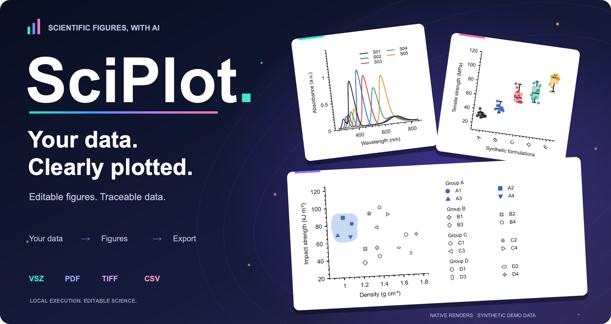
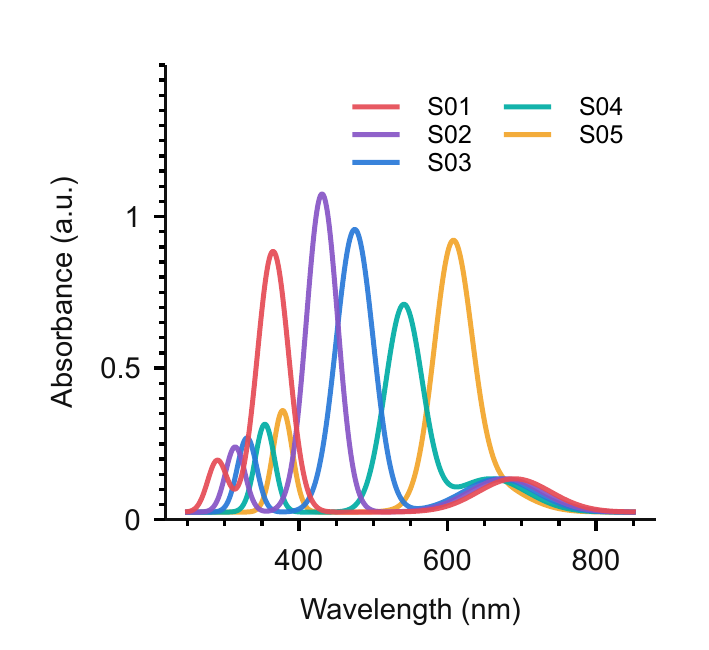
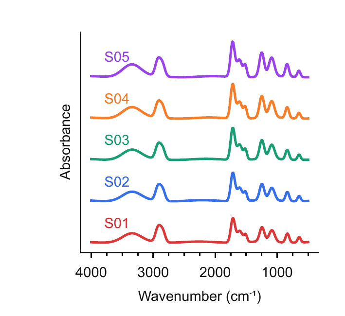
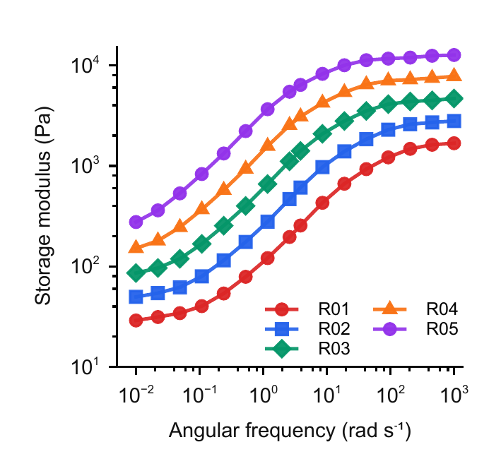
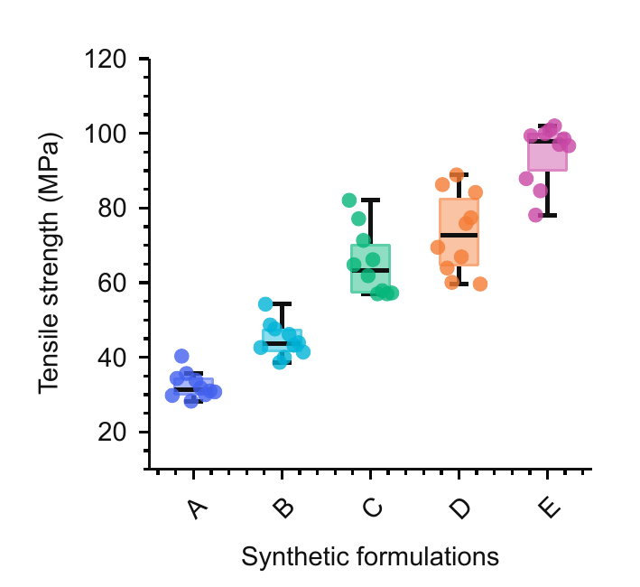
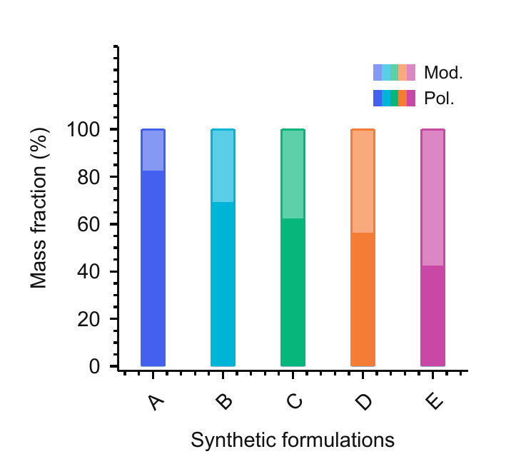
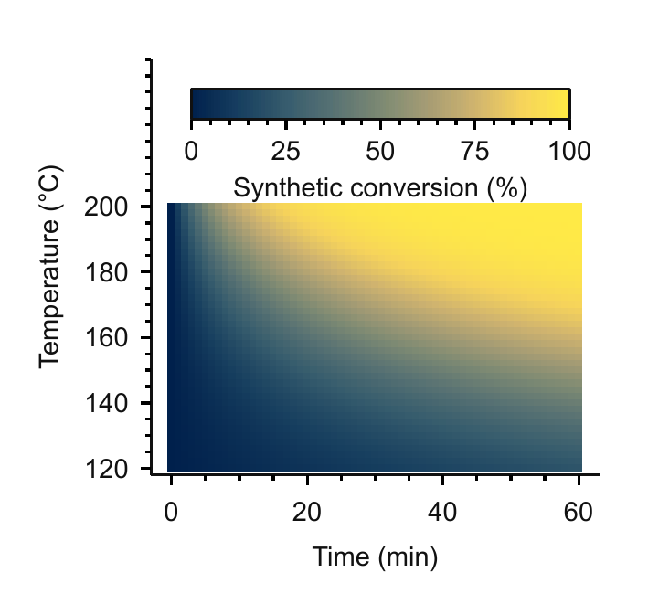
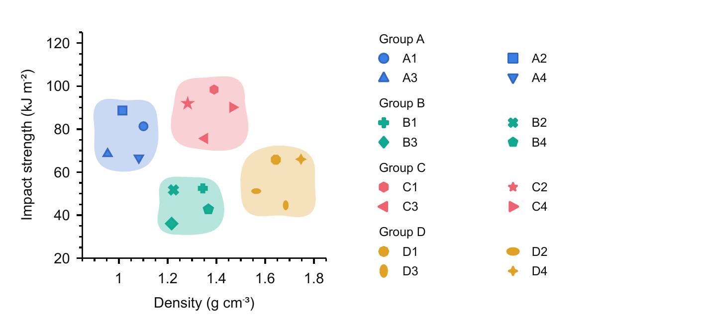
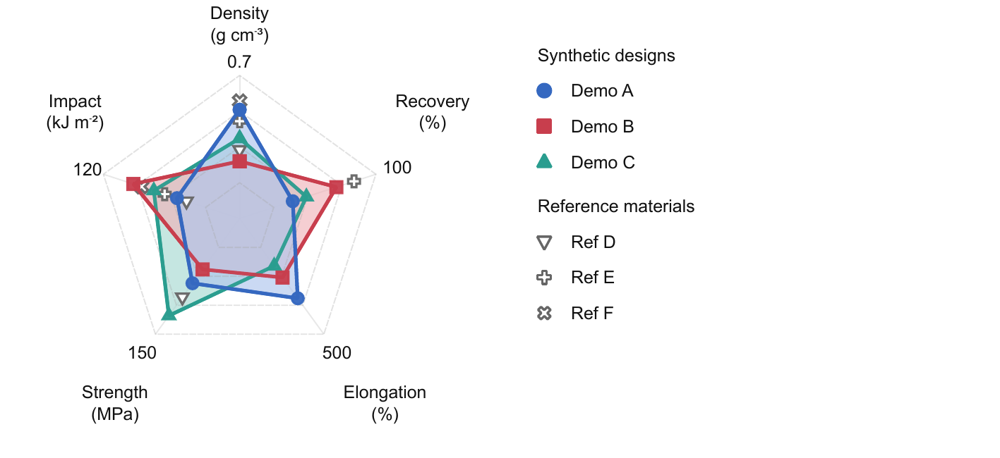

# SciPlot



**From experimental data to editable scientific figures.**

SciPlot is a local scientific plotting tool for use with an external AI assistant.
Describe your figure, review the result, and export it with its plotting data.
Figures stay editable in Veusz, so you can return to a saved project and keep refining it.

[Gallery](#gallery) · [Get started](#get-started) · [Use with AI](#use-with-ai) · [Exports](#exports)

## Gallery

Synthetic examples rendered by SciPlot / Veusz with default colors. Standard figures use **60 × 55 mm**;
performance comparisons use **120 × 55 mm**. Click any image to view it at full size.
[Data and reproduction notes](docs/assets/showcase/v2/README.md).

<table>
  <tr>
    <td width="50%" valign="top">
      <b>Multi-sample spectra</b><br>
      <a href="docs/assets/showcase/v2/spectra/spectra-rich.png"></a><br>
      Five samples, with clear colors and axis units.
    </td>
    <td width="50%" valign="top">
      <b>Stacked spectra</b><br>
      <a href="docs/assets/showcase/v2/curves/stacked-spectra.png"></a><br>
      Five curves, offset vertically for easy comparison.
    </td>
  </tr>
  <tr>
    <td width="50%" valign="top">
      <b>Rheology</b><br>
      <a href="docs/assets/showcase/v2/curves/rheology-point-lines.png"></a><br>
      Five curves, 16 points each, on logarithmic axes.
    </td>
    <td width="50%" valign="top">
      <b>Replicate distributions</b><br>
      <a href="docs/assets/showcase/v2/distributions/replicate-distributions.png"></a><br>
      Five samples, 10 replicates each, with individual points.
    </td>
  </tr>
  <tr>
    <td width="50%" valign="top">
      <b>Composition</b><br>
      <a href="docs/assets/showcase/v2/distributions/composition-bars.png"></a><br>
      Five formulations, two components, totaling 100%.
    </td>
    <td width="50%" valign="top">
      <b>Response map</b><br>
      <a href="docs/assets/showcase/v2/distributions/response-heatmap.png"></a><br>
      A continuous response field with a labeled color scale.
    </td>
  </tr>
  <tr>
    <td colspan="2">
      <b>Performance comparison</b><br>
      <a href="docs/assets/showcase/v2/performance/performance-scatter-rich.png"></a><br>
      Four samples and twelve references. Shading shows the sample range, not a confidence interval.
    </td>
  </tr>
  <tr>
    <td colspan="2">
      <b>Multi-metric comparison</b><br>
      <a href="docs/assets/showcase/v2/performance/performance-radar-rich.png"></a><br>
      Complete samples form polygons; incomplete references show only their available data points.
    </td>
  </tr>
</table>

## What you can do

- Plot mechanics, rheology, thermal analysis, spectra, scattering, and material comparisons.
- Preview changes to colors, fonts, legends, and annotations before applying them.
- Change ordinary curves together by their exact sample labels, and save successive edits before exporting.
- Save sample colors and line widths as a preset, then reuse them by sample name across other experiment figures, including matching marker and direct-label colors.
- Run an explicit experiment group, continue each task independently, and inspect all native figures in one local gallery. Search by experiment or sample, filter items needing attention, and copy source/document/delivery paths. Data, export and delivery freshness are shown separately; repeated queries reuse unchanged previews.
- Compare 2–8 native alternatives for the same saved figure, view each beside the original, and inspect their differences. Copy a choice back to your AI assistant to apply exactly one candidate or keep the original. Viewing and copying never apply changes; the assistant rechecks the comparison before acting.
- Refine a pending preview in the same task; styles that already match need no extra confirmation or save.
- Preserve sample identities, units, and data sources. Missing reference values stay missing.
- Reopen saved projects and continue editing with AI or directly in Veusz.
- Find previous task-created projects from their original data path when starting a new AI session.

SciPlot runs plotting and exports locally. It does not require an internal model or API key;
your external AI assistant uses its own model connection.

## Get started

Source setup requires **Python 3.11+**, a **C/C++ compiler**, and **Qt 6 development tools**, including `qmake`.
From a checkout of this repository:

```bash
python3 -m venv .venv
.venv/bin/python -m pip install -e '.[studio,mcp]'
(cd third_party/veusz && ../../.venv/bin/python setup.py build_ext --inplace)
skill/scripts/sciplot doctor --json
```

Continue when the environment check reports `status=ready`. If `qmake` is outside your
`PATH`, set `QMAKE_EXE` to its location before building. Source setup has been checked
locally on macOS; Windows and Linux installation is not yet verified.

## Use with AI

Connect an AI assistant that can run local commands, or use SciPlot's optional MCP server:

```bash
skill/scripts/sciplot mcp
```

Then describe the figure you need:

> Use SciPlot to plot the five samples in `/path/to/spectra.csv`.
> Check the sample names and units, use a 60 × 55 mm figure, and export PDF and TIFF.

Continue with a simple follow-up:

> Reopen that project, change the second curve to blue, and show me a preview.

For a few rounds of refinement:

> Make the E0 and E3 curves thicker. Save the change so we can keep editing;
> export PDF and TIFF when I ask for the final figures.

Reuse a style you have already settled on:

> Save the E0, E2 and E3 styles from this UV–vis figure. Apply them to my FTIR
> figure by sample name, keeping the FTIR data and axes unchanged.

The [AI connection guide](skill/references/external-control.md) covers CLI and MCP setup.
If data or units are ambiguous, SciPlot reports what needs clarification before plotting.

## Exports

| File | Purpose |
| --- | --- |
| **VSZ** | Editable Veusz document with embedded plotting data |
| **PDF** | Vector figure for manuscripts and presentations |
| **300 dpi TIFF** | Raster figure for submission |
| **CSV** | Source-derived plotting data |

Outputs are saved beside your source data in `SOURCE_SciPlot/` by default.
Use `Open_in_Veusz.command` in the export folder to reopen a figure.
Your original data files are preserved.

Licensed under [GPL-2.0](LICENSE). See [third-party notices](docs/THIRD_PARTY_NOTICES.md).
