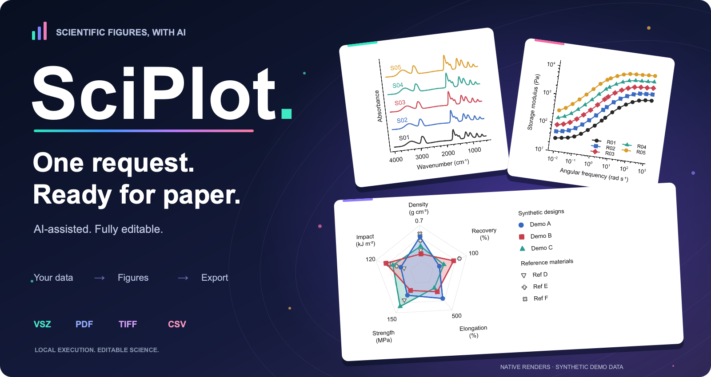
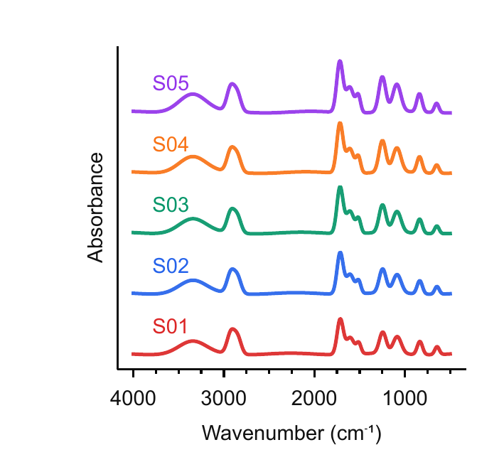
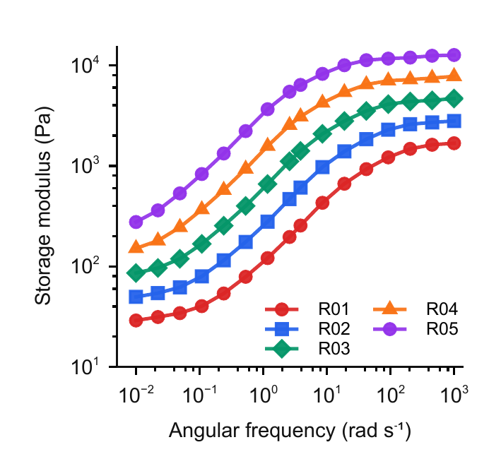
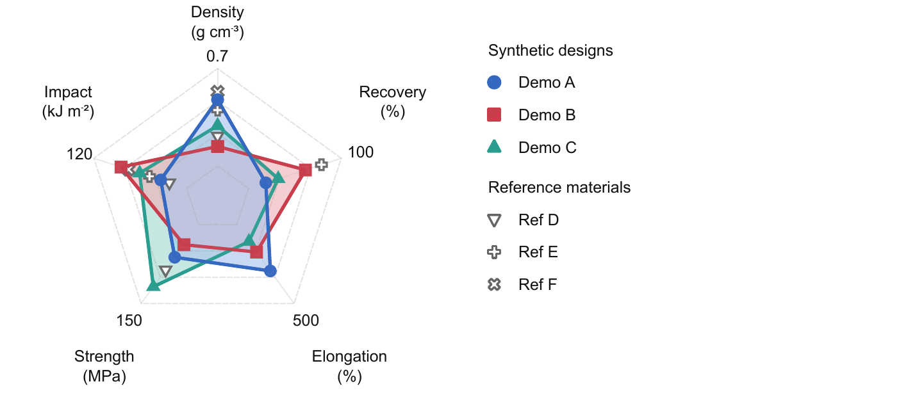
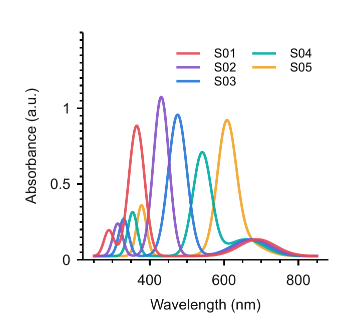
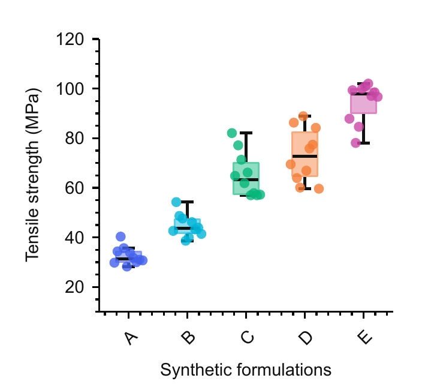
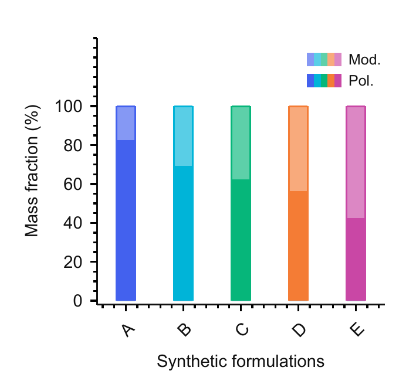
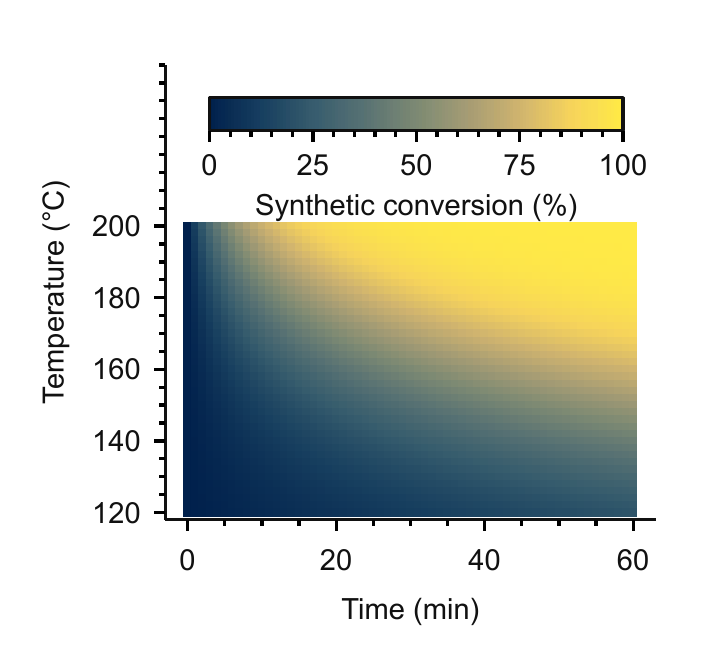
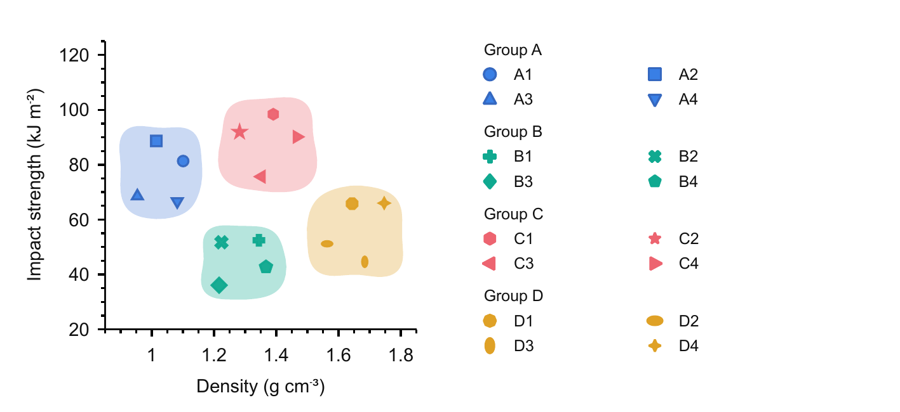

# SciPlot

### Publication-ready figures. One request away.

**AI 辅助，一键出图。让实验数据直接成为可编辑的论文图稿。**

Ask your AI assistant for the figure you need. SciPlot turns experimental data into **vector PDF,
300 dpi TIFF, plotting CSVs, and an editable project** in one workflow.
Bring the result into your manuscript, then keep refining it as your research evolves.

[**Download source ↓**](https://github.com/tunghsutian-creator/Science-Plot/archive/refs/heads/main.zip) · [Get started](#get-started) · [See the figures](#gallery) · [Connect your AI](#connect-your-ai)



## From experiment to manuscript

- **Ask for the figure, in your own words.** Your AI assistant interprets the request;
  SciPlot handles data preparation, plotting, checks, and export locally.
- **Start with publication-sized output.** Consistent typography, physical dimensions,
  and vector graphics help your figures fit together across a paper.
- **Keep control after export.** Reopen the editable figure, adjust its appearance,
  and regenerate the files. Your original data stays intact.

For example, tell your AI assistant:

> Use SciPlot to plot the five samples in `/path/to/spectra.csv`.
> Keep the original sample names and units. Make a 60 × 55 mm figure
> and export PDF, TIFF, and the editable project for my paper.

**Give it your data → describe the figure → review the result.**
Once the data and intent are clear, one local task carries the figure through to
export. If samples, units, or worksheet choices are ambiguous, SciPlot asks for
clarification before proceeding.

Saved ordinary figures also support a persistent semantic editing engine. Open a
project once with `sciplot plot open TARGET --json`, then send `plot.patch` using
the returned plot ID, revision and stable series IDs. A safe width/color/title
visibility edit validates, commits and exports in one transaction; the program
owns native paths and recovery. Repeating its idempotency key resumes the same
work. Structural changes return a bound preview when needed. CLI and MCP share
this engine; existing projects retain their native VSZ and explicit partial-import
coverage. See the [saved-figure route](skill/references/saved-figure-edit.md).

The same patch surface covers supported axis limits, legend placement/visibility
and managed annotations. Template creation separates the format, theme and explicit
data binding, then produces one final export. A saved native-only change can return
one audited reimport preview; source or mapping changes still require their
scientific workflow. The local service reuses its native worker between operations.

Template-based `plot.create` now creates a **ManagedPlot** by default for the
supported Cartesian and FigureSpec v2 contracts. Its SciPlotDocument is authoritative:
resolved PlotIR compiles into disposable VSZ, previews and PDF/TIFF. Keeping raw
sources and `.sciplot_documents` is sufficient to rebuild deleted artifacts with
`plot export`. Source/transform/executor updates require explicit scientific
intent; theme edits preserve scientific identity. Fixed-file external scientific
executors carry interpreter/script hashes and provenance. Unknown manual Veusz
changes block rather than enter the canonical document.

Existing VSZ imports, source-only task creation and explicit `mode: legacy` remain
**LegacyPlot** compatibility workflows. FigureSpec v2 adds physical single/concat/grid
composition, independent scientific Scales and visual Axes, seven generic Marks,
scoped themes, semantic legends and data/view/figure annotations. Dual Y and
multipanel scientific figures use this common grammar. Native text bounds and
scientific mapping checks gate export; soft layout warnings remain explicit.
Arbitrary native features and non-deterministic execution remain unsupported.
New FigureTemplate documents pin the extracted `sciplot-house-style-v1` visual
contract. Omitted layout uses the original 60 × 55 mm panel and fixed physical
margins; theme/figure/view/layer/mark overrides stay explicit. Existing unbound
Managed revisions and fully explicit Cartesian v1 templates retain their saved
presentation. Old-versus-new visual regression is independent of rebuild QA.
See [rendering contract](docs/DESIGN_RENDERING_CONTRACT.md),
[Figure grammar, schemas and capabilities](docs/DESIGN_FIGURE_GRAMMAR.md) and
[managed authority guarantees](docs/DESIGN_MANAGED_PLOTS.md).

Real historical mechanical and PP frequency-sweep deliveries now have independent
golden-master profiles: frozen accepted artifacts, fresh legacy production replay,
and ManagedPlot must pass native structure, data, environment and raster checks.
See [research compatibility profiles and evidence](docs/RESEARCH_COMPATIBILITY_PROFILES.md)
for exact coverage, the bounded mechanical antialias difference, and unsupported cases.

Ordinary raw-data entry (`task create`, source-only `plot.create`, and their MCP
routes) keeps the existing production workflow: scientific recognition, the
family's FigurePlan and templates, then shared house policy plus family rules and
supported explicit overrides. `render --auto` uses that same workflow; plain
`render --template` remains a low-level plot-ready operation. FigureTemplate v2
is an explicitly composed Managed route, not the automatic raw-data default.
Its RenderingStyleContract is extracted from production policy; unverified
family compatibility is not a reason to silently switch ordinary plots to it.

## Gallery

These figures were rendered by **SciPlot / Veusz** from synthetic demonstration
data. Standard figures use **60 × 55 mm**; performance comparisons use
**120 × 55 mm**. Click an image for the full-size view.

<table>
  <tr>
    <td width="50%" valign="top">
      <b>Spectral fingerprints, clearly separated</b><br>
      <a href="docs/assets/showcase/v2/curves/stacked-spectra.png"></a><br>
      Compare five spectra with direct labels and consistent sample colors.
      Curves are offset for display; source values are preserved.
    </td>
    <td width="50%" valign="top">
      <b>Rheology, across five decades</b><br>
      <a href="docs/assets/showcase/v2/curves/rheology-point-lines.png"></a><br>
      Distinct markers and a shared color palette make five rheology curves easy to follow.
    </td>
  </tr>
  <tr>
    <td colspan="2" valign="top">
      <b>Five properties. One comparison.</b><br>
      <a href="docs/assets/showcase/v2/performance/performance-radar-rich.png"></a><br>
      Compare the balance of properties across samples. Reference materials retain only
      their available measurements; polygon area is not an overall performance score.
    </td>
  </tr>
</table>

<details>
<summary><b>More examples: absorption spectra, distributions, composition, response maps, and scatter comparisons</b></summary>

<table>
  <tr>
    <td width="50%" valign="top">
      <b>Absorption spectra</b><br>
      <a href="docs/assets/showcase/v2/spectra/spectra-rich.png"></a><br>
      Bring multiple samples into one consistent figure.
    </td>
    <td width="50%" valign="top">
      <b>Replicate distributions</b><br>
      <a href="docs/assets/showcase/v2/distributions/replicate-distributions.png"></a><br>
      Show the distribution and the individual observations together.
    </td>
  </tr>
  <tr>
    <td width="50%" valign="top">
      <b>Composition</b><br>
      <a href="docs/assets/showcase/v2/distributions/composition-bars.png"></a><br>
      Compare the composition of five formulations at a glance.
    </td>
    <td width="50%" valign="top">
      <b>Response maps</b><br>
      <a href="docs/assets/showcase/v2/distributions/response-heatmap.png"></a><br>
      Make trends across two variables easy to read.
    </td>
  </tr>
  <tr>
    <td colspan="2">
      <b>Performance comparison</b><br>
      <a href="docs/assets/showcase/v2/performance/performance-scatter-rich.png"></a><br>
      Put your samples in context. Shading shows the sample range, not a confidence interval.
    </td>
  </tr>
</table>

</details>

[Explore the example data and reproduction notes →](docs/assets/showcase/v2/README.md)

SciPlot supports **mechanics, rheology, DSC/TGA, FTIR/UV–vis, XRD/SAXS, GPC/SEC,
torque, swelling, and material performance comparisons**, using supported
instrument exports and CSV, TSV, or Excel tables. Multi-sheet workbooks and
curves with different row ranges can stay in their original files.

## What you get

Each delivery includes the figure and the files needed to revisit it:

| Output | Ready for |
| --- | --- |
| **Vector PDF** | Manuscripts, presentations, and crisp scaling |
| **300 dpi TIFF** | Submission workflows that require raster figures |
| **Editable VSZ** | Further refinement in SciPlot or Veusz, with plotting data embedded |
| **Plotting CSVs** | Inspecting and reusing the source-derived data behind the figure |

Outputs are saved beside your source data in `SOURCE_SciPlot/` by default.
Original files, sample identities, units, and data provenance are preserved.
Missing reference values stay missing.

Physical-size and export checks are part of the workflow. Match the final
dimensions, resolution, and styling to your target journal's requirements.

## Your figure stays editable

Keep working with the same AI assistant:

> Make the E0 and E3 curves thicker and show me a preview.

> Reuse these sample colors in my FTIR figure, matching by sample name.

> Show me three style alternatives for this figure so I can choose one.

For direct adjustments, double-click **`Open_in_SciPlot.command`** in the delivery
folder. Select a curve or sample, adjust its supported visual properties, and see
the figure redraw. Native undo and redo let you explore changes.

- **Save** updates the editable project.
- **Save and update delivery** also refreshes the delivered VSZ, PDF, and TIFF
  through the existing checks.

The canvas resumes the original managed project. For advanced native editing,
use `Open_in_Veusz.command`. A copied delivery can open its portable Veusz file;
editing that copy does not update the original project. See the
[editing and continuation guide](skill/references/advanced-workflows.md) for
source updates, moved deliveries, and separately edited files.

## Get started

**[Download the source ZIP](https://github.com/tunghsutian-creator/Science-Plot/archive/refs/heads/main.zip)**
or clone the repository below. The current download is source code; a signed
macOS installer has not been published yet.

Source installation requires **Python 3.11+**, a **C/C++ compiler**, and
**Qt 6 development tools**, including `qmake`.

```bash
git clone https://github.com/tunghsutian-creator/Science-Plot.git
cd Science-Plot

python3 -m venv .venv
.venv/bin/python -m pip install -e '.[studio,mcp]'
(cd third_party/veusz && ../../.venv/bin/python setup.py build_ext --inplace)
skill/scripts/sciplot doctor --json
```

If you downloaded the ZIP, open a terminal in the extracted folder and start
with the `python3 -m venv .venv` command. Continue when Doctor reports
`status=ready`. If `qmake` is outside your `PATH`, set `QMAKE_EXE` to its location
before building.

Source setup has been checked locally on macOS. Windows and Linux installation
are not yet verified; independent installation and beginner acceptance are
tracked in the [acceptance protocol](docs/INDEPENDENT_ACCEPTANCE.md).

### Connect your AI

SciPlot is a local scientific plotting tool for use with an external AI assistant.
It runs plotting and exports locally. SciPlot itself needs no model API key;
your assistant uses its own model connection.

**With a coding assistant:** give it the repository path and ask it to read
[`skill/SKILL.md`](skill/SKILL.md). Then describe your figure and provide the
path to your data, as in the example above.

**With an MCP client:** add a local stdio server using the absolute path to
`skill/scripts/sciplot` as the command and `mcp` as its argument.

<details>
<summary>Example configuration for clients that use <code>mcpServers</code></summary>

Replace the example path with your checkout location:

```json
{
  "mcpServers": {
    "sciplot": {
      "command": "/absolute/path/Science-Plot/skill/scripts/sciplot",
      "args": ["mcp"]
    }
  }
}
```

</details>

The assistant needs access to your local files. See the
[AI connection guide](skill/references/external-control.md) for CLI and MCP details.

## Explore and contribute

- [Example data and figure recipes](docs/assets/showcase/v2/README.md)
- [Advanced workflows: editing, style reuse, comparisons, and source updates](skill/references/advanced-workflows.md)
- [Architecture](docs/ARCHITECTURE.md) · [Development roadmap](DEVELOPMENT_ROADMAP.md)
- [Report a bug or request a feature](https://github.com/tunghsutian-creator/Science-Plot/issues)

If SciPlot helps with your research, **star the repository** to help other
researchers discover it.

Licensed under [GPL-2.0](LICENSE). See [third-party notices](docs/THIRD_PARTY_NOTICES.md).
